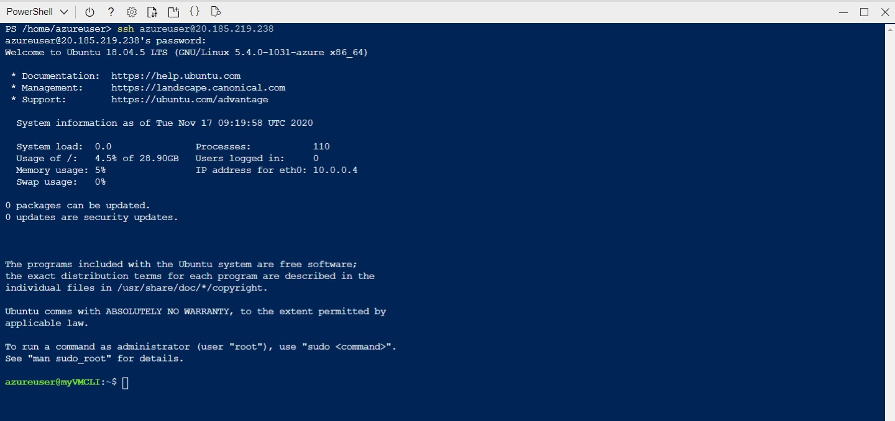
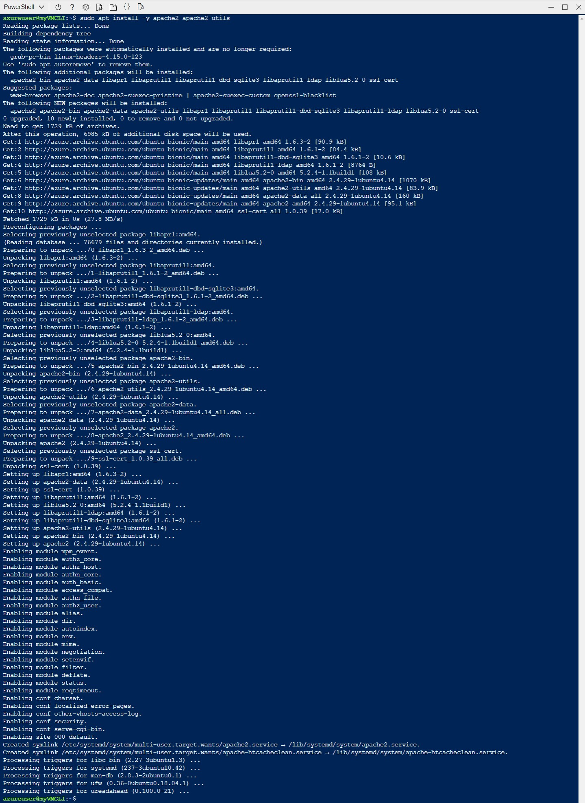

# Creacion de la maquina virtual en Azure Cli

Utilizamos la cuenta proporcionada por Nanfor


### 1 - Conectarse desde Azure Cli A Azure

```
az login
```

Como estoy utilizando la consola desde el portal de azure no hace falta lanzar este comando ya que te loga directamente en el portal con la cuenta anterior

### 2 - Crear un grupo de recursos

Desde la consola lanzamos el siguiente comando:

```
az group create -l EastUS -n myRGCLI 
```


Listamos los grupos de recursos para comprobar que se ha creado correctamente


### 3 - Crear la máquina virtual Linux (Ubuntu)

La máquina virtual la crearemos con el nombre (parametro:name) **myVMCLI** la crearemos en el grupo de recursos (parametro:resource-group) **myRGCLI** utilizando una imagen (parametro: image) Ubuntu LTS. La ubicaremos en la zona geografica (parametro:location) **East US** Crearemos un usuario administrador (parametro:admin-username) **azureuser** con la password (parametro:admin-password) **Passw0rd1234** y el parametro **no-wait** nos permite que se haga de forma asincrona de tal manera que no tendremos que esperar a que termine de crearse la máquina

Desde la consola lanzamos el siguiente comando:

```
az vm create ^
 --name myVMCLI ^
 --resource-group myRGCLI ^
 --image UbuntuLTS ^
 --location EastUS ^
 --admin-username azureuser ^
 --admin-password Passw0rd1234 ^
 --no-wait
```


Listamos los elementos que ha creado en el grupo de recursos **myRGCLI** para comprobar que se ha creado correctamente la máquina virtual


### 4 - Conectarse a la máquina Virtual de Linux

Antes de conectarnos debemos averiguar que IP tiene asignada la máquina que acabos de crear podemos hacer lo lanzando desde la consola el siguiente comando:	

``` 
az vm list-ip-addresses --resource-group myRGCLI --name myVMCLI
```


O bien seleccionando la maquina desde el portal


Ahora lanzamos el siguiente comando por la consola:

```
ssh azureuser@20.185.219.238
Nota: Dar que si en la creación del certificado SSH
```



### 5 - Actualizar en Linux

Descargamos los paquetes de actualizacion utilizando el siguiente comando:

```
sudo apt-get update
```


### 6 - Hacer el upgrade

Actualizamos utilizando el siguiente comando:

```
sudo apt upgrade
```


### 7 - Instalar un servidor web

Instalamos el servidor apache utilizando el siguiente comando:

```
sudo apt install -y apache2 apache2-utils
```



### 8 - Vemos el estatus de Apache

Arrancamos el servidor y comprobamos el estado utilizando el siguiente comando:

```
systemctl status apache2
```


### 9 - Ponemos un mensaje en nuestra página de Apache

Vamos a la ubicación de la pagina de inicio que se encuentra en **/var/www/html**

```
cd /var/www/html
```


### 10 - Poner una nota en la página index.html

Editamos con el "**vi**" la pagina index.html colocamos el mensaje: "**PÁGINA DE INICIO MODIFICADA POR FCO JAVIER**"

```
sudo vi index.html <ENTER>
<ESC> : 198 <ENTER> // irme a la linea 198 que es donde esta el mensaje de index.html
<i> PONER EL MENSAJE <ESC>
: x <ENTER>

```


### 11 - Salir del SSH

```
exit <ENTER>
```


### 12 - Abrimos el puerto 80 

Para que el servidor apache pueda atender peticiones tenemos que abrir el puerto 80. Eso lo hacemos añadiendo esta regla en el grupo de seguridad asociado a la maquina **myVMCLINSG**


Como se puede comprobar el puerto 80 esta cerrado. Pulsamos sobre "**Reglas de seguridad de entrada**" en el menu de la izquierda y pulsamos en el boton agregar para añadir esa regla.


Comprobamos que podemos acceder


## 13 - Parar y "deallocate" la máquina virtual

```
az vm stop --resource-group myRGCLI --name myVMCLI --no-wait
```

```
az vm deallocate -g myRGCLI -n myVMCLI --no-wait
```


## 14 - Borrar la máquina virtual y mostrar informacion de la máquina virtual

```
az vm delete -g myRGCLI -n myVMCLI --yes --no-wait
```

```
az vm show -g myRGCLI -n myVMCLI -d
```


### 15 - Borrar el grupo de recursos

```
az group delete -n myRGCLI  --yes --no-wait
```


